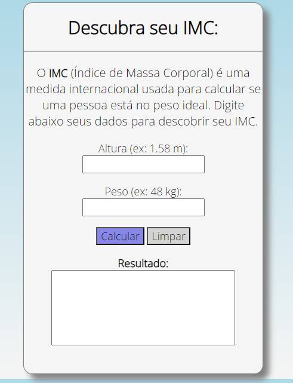

# calculadoraimc

Calculadora de IMC simples feita para uma atividade da disciplina de Programação Web do curso de Ciência da Computação. 
Utilizando HTML, CSS e Javascript, ela mostra o resultado do cálculo e se o usuário está com o peso normal ou não. 

Acesse aqui: https://nathyalves.github.io/calculadoraimc/
